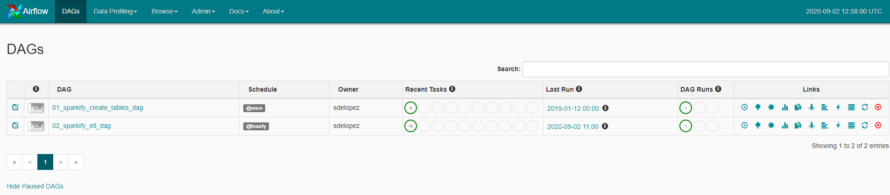
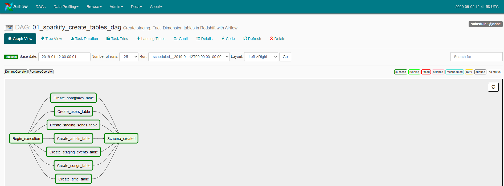
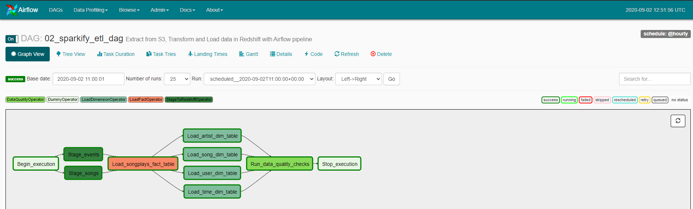
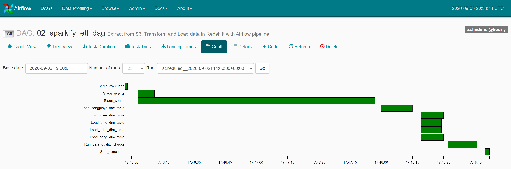
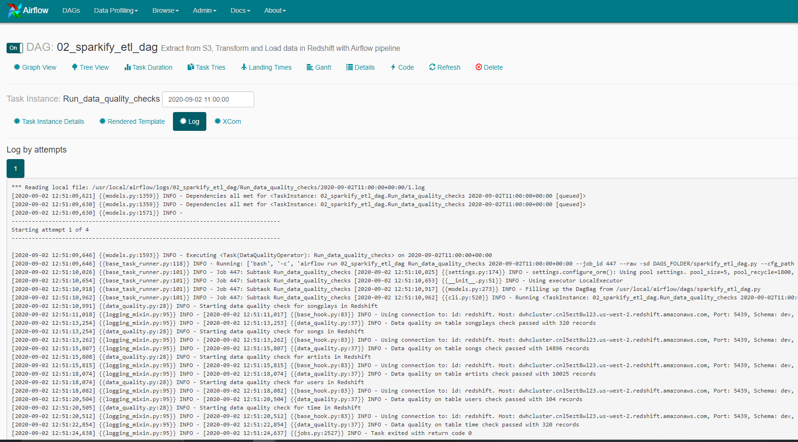

[UDACITY DATA ENGINEERING NANODEGREE](https://classroom.udacity.com/nanodegrees)

Project: Data Pipelines with Airflow
----

# **Introduction**

A music streaming company, Sparkify, has decided that it is time to introduce more automation and monitoring to their data warehouse ETL pipelines and come to the conclusion that the best tool to achieve this is Apache Airflow.

They have decided to bring you into the project and expect you to create high grade data pipelines that are dynamic and built from reusable tasks, can be monitored, and allow easy backfills. They have also noted that the data quality plays a big part when analyses are executed on top the data warehouse and want to run tests against their datasets after the ETL steps have been executed to catch any discrepancies in the datasets.

The source data resides in S3 and needs to be processed in Sparkify's data warehouse in Amazon Redshift. The source datasets consist of JSON logs that tell about user activity in the application and JSON metadata about the songs the users listen to.

# **Project Description**
This project will introduce you to the core concepts of Apache Airflow. To complete the project, you will need to create your own custom operators to perform tasks such as staging the data, filling the data warehouse, and running checks on the data as the final step.

We have provided you with a project template that takes care of all the imports and provides four empty operators that need to be implemented into functional pieces of a data pipeline. The template also contains a set of tasks that need to be linked to achieve a coherent and sensible data flow within the pipeline.

You'll be provided with a helpers class that contains all the SQL transformations. Thus, you won't need to write the ETL yourselves, but you'll need to execute it with your custom operators.  

The objective is to built the following pipeline using Airflow.


# **Project Datasets**
Two datasets that reside in S3 are provided. Here are the S3 links for each:

- Song data: s3://udacity-dend/song_data
- Log data: s3://udacity-dend/log_data

# **Project Files**


Project Structure :  
├── airflow  
│   ├── dags  
│   │   ├── sparkify_create_tables_dag.py  
│   │   └── sparkify_etl_dag.py  
│   └── plugins  
│       ├── helpers  
│       │   ├── __init__.py  
│       │   └── sql_queries.py  
│       ├── __init__.py  
│       ├── operators  
│       │   ├── __init__.py  
│       │   ├── data_quality.py  
│       │   ├── load_dimension.py  
│       │   ├── load_fact.py  
│       │   └── stage_redshift.py  
├── docker-compose.yaml  
├── README.md  
└── requirements.txt  

- **./dag/sparkify_create_tables_dag.py** DAG to create Fact and Dimension tables in Redshift  (Run only on trigger)
- **./dag/sparkify_etl_dag.py** DAG to run on a schedule basis ETL for sparkify data  (sheduled hourly)
- **./plugins/helpers/sql_queries.py** SQL queries to create tables, copy data to tables in Redshift  
- **./plugins/operators/stage_redshift.py** Stage data to Redshift operator  
- **./plugins/operators/load_dimension.py** Load to dimension table operator  
- **./plugins/operators/load_fact.py** Load to Fact table operator  
- **./plugins/operators/data_quality.py** Data quality check operator. Check that the table is not empty and count elements in table
- **requirements.txt** PIP install requirements to install necessary python packages  (including AWS CLI packages to work with Amazon Web Services)  
- **docker-compose.yaml** Docker-compose configuration to run a local Airflow webserver/scheduler for local DAG developement and testing  

# **ETL logic**

## Airflow DAG workflow

2 DAGs are configured in Aiflow :

DAG to create staging, fact, dimension tables in Redshift

DAG to process ETL operations  in Redshift (scheduled hourly)



## **Initial dataset - Raw JSON data structures**

- **log_data**: log_data contains data about what users have done (columns: event_id, artist, auth, firstName, gender, itemInSession, lastName, length, level, location, method, page, registration, sessionId, song, status, ts, userAgent, userId)
- **song_data**: song_data contains data about songs and artists (columns: num_songs, artist_id, artist_latitude, artist_longitude, artist_location, artist_name, song_id, title, duration, year)

## **Schema for fact, dimension tables**

We will create a star schema optimized for queries on song play analysis. This includes the following tables. Using the songs and log datasets in S3 buckets, data will be transformed and loaded into the fact and dimensions tables in S3 buckets.

### **Dimension Tables**

- **songs_table**: song info (columns: song_id, title, artist_id, year, duration) -> extracted from songs_data. Table **partitionned by year and then artist_id**
- **users_table**: user info (columns: user_id, first_name, last_name, gender, level) -> extracted from song_data
- **artists_table**: artist info (columns: artist_id, name, location, latitude, longitude) -> extracted from log_data.
- **time_table**: detailed time info about song plays (columns: start_time, hour, day, week, month, year, weekday) -> extracted from log_data. Table **partitionned by year and month**

### **Fact Table

- **songplays**: song play data together with user, artist, and song info (songplay_id, start_time, user_id, level, song_id, artist_id, session_id, location, user_agent) -> created by joining log_data and songs_table. Table **partitionned by year and month**

# **Running ETL process with Airflow**

## **Developing and running Airflow in local mode**

We will use Docker to setup Aiflow services (using LocalExecutor with Postgres for the metadatabase) :  
- a local Airflow scheduler/webserver (version 1.10.2) configured with a LocalExecutor  
- a postgres database for the Airflow metadatabase  

For more details on running Airflow with Docker, read the Medium article [Getting Started with Airflow Using Docker](https://towardsdatascience.com/getting-started-with-airflow-using-docker-cd8b44dbff98)  

Description of Dockerfile is found on Github : [puckel\docker-airflow](https://github.com/puckel/docker-airflow)  

Airflow Ressources : you will find many ressources to operate Airflow in Marc Lamberti's excellent blog dedicated to Airflow [MarcLamberti:LearningCodeScale](https://marclamberti.com/blog/)

### **Configuring parameter, monitoring Airflow**

Spin-up an Airflow scheduler/webserver in LocalExecutor Mode :

```docker
docker-compose up -d
```
- Airflow webserver is exposed on : http://localhost:8080/
- the postgres metadabase is exposed on port 5432

I recommand using Microsoft VS Code IDE with Remote - Docker extension to work easily for developping Airflow DAG in docker

### **Running the workflow**

Before running the DAG, several credentials and variables must be set in Airflow :  
- Credentials to AWS services and Redshift cluster must be set in Airflow Admin/Connection UI
- S3 path info must be set in Airflow Admin/Variables UI
    - s3_bucket : udacity-dend
    - s3_prefix_log : log_data
    - s3_prefix_song : song_data

Airflow DAG run can be monitored through various tools from Airflow UI. One the these tools is the GANTT chart to view the task duration/orchestration timeline



Quality check after populating fact and dimensions table
